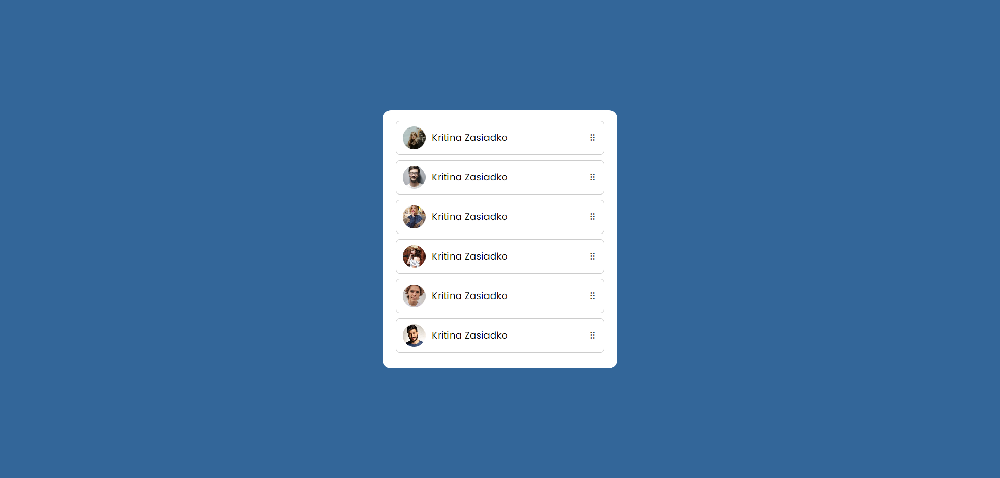

  

# 🎭 Drag and Drop List
Projeto de uma lista Drag and Drop, ou seja com a funcionalidade de puxar o item da lista e colocar onde você quiser.

- Veja o projeto: [Live Preview](https://victtor-drag-and-drop.vercel.app/)

## ⚙️ Funcionalidades

- [x] Funcionalidade Drag and Drop, coloca o item da lista onde você quiser;
- [x] O item que está puxado, fica meio transparente para mostar ao usuário;
- [x] Os items vão trocando de lugar conforme o usuário "organiza" a lista;
- [x] Feito somente com Javascript sem plugins ou bibliotecas;

## 🚀 Tecnologias

- [HTML](https://www.w3schools.com/html/)
- [CSS](https://developer.mozilla.org/pt-BR/docs/Web/CSS)
- [JavaScript](https://developer.mozilla.org/pt-BR/docs/Web/JavaScript)

## 📝 Considerações

Fiz esse projeto para aprender a lógica por trás dessa funcionalidade, e para posteriormente, incrementar essa mesma funcionalidade ao meu To Do List;
